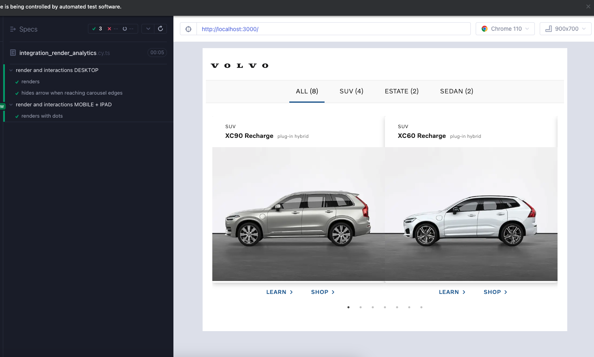
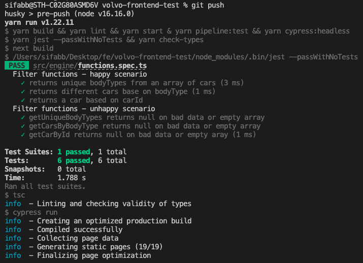
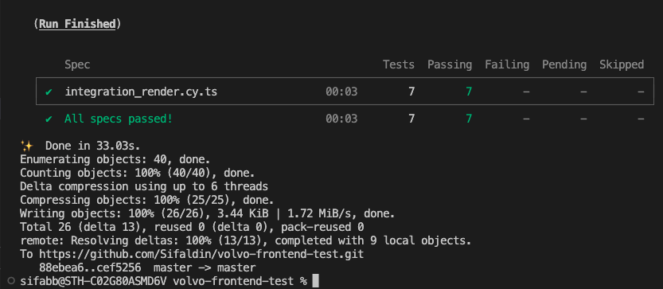

# Volvo Cars (Global Online Digital)

### Desktop


### Mobile


```json
[
  {
    "id": "xc90-recharge",
    "modelName": "XC90 Recharge",
    "bodyType": "suv",
    "modelType": "plug-in hybrid",
    "imageUrl": "/images/xc90_recharge.jpg"
  }
]
```

The product owner is telling you that you can generate the links to the learn and shop pages of each car by concatating the `id` of the car to the learn (`/learn/`) and shop (`/shop/`) urls.

## Requirements

- The project is bootstraped using [Next.js](https://nextjs.org/).
- Browser support is modern ever-green browsers.
- Implement this design using React and Typescript.
- Accessibility is important.
- Code Structure and reusablity is important.

## Bonus Points:

- If you use our design system component library, [VCC-UI](https://vcc-ui.vercel.app/)
- If you add a filter bar on the top to filter cars by `bodyType`

# Dev Setup

## Install dependencies via:

```
yarn install
```

## Running cypress

```
yarn dev-cypress
```


**NOTE:** Component have `Husky` set up on pre-push to ensure that changes done
won't break existing or future tests.



**NOTE:** An NPM Package named `volvocars` was created to share eslint config between applications.
More can be found here [Github](https://github.com/Sifaldin/volvo-eslint-config) + [NPM](https://www.npmjs.com/package/eslint-config-volvocars)
[](https://www.npmjs.com/package/eslint-config-volvocars)  

**NOTE:** Solution have been deployed to Vercel. https://volvo-frontend-task.vercel.app/


